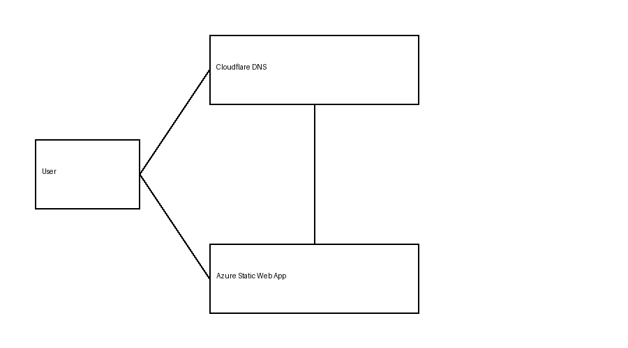

# 🌐 Portfolio en Azure Static Web Apps + Dominio Personalizado

## 🏗️ Diagrama de arquitectura

---

## 🚀 Arquitectura

- Frontend: HTML / CSS / JS
- Hosting: Azure Static Web Apps
- DNS: Cloudflare
- Dominio: estebanmndz.dev

---

## 🧠 Objetivo

Desplegar un sitio web estático en Azure con dominio personalizado, SSL y DNS correctamente configurado.

---

## ⚙️ Configuración

### 1. Azure Static Web Apps
- Deploy automático
- URL base: ambitious-hill-xxxx.azurestaticapps.net

### 2. DNS (Cloudflare)

- CNAME www → azurestaticapps
- CNAME root (@) → azurestaticapps (flattening)
- TXT → validación Azure

---

## ⚠️ Problema clave

El dominio raíz no soporta CNAME en DNS estándar.

💡 Solución: Cloudflare CNAME flattening

---

## 🔐 SSL

- Certificado automático en Azure
- Requiere dominio validado + DNS correcto

---

## 🧪 Validaciones

nslookup estebanmndz.dev

nslookup www.estebanmndz.dev

---

## ✅ Resultado

- HTTPS funcionando
- Dominio root + www operativos
- Infraestructura cloud funcional

---

## 📚 Aprendizajes

- DNS en producción
- CNAME vs ALIAS
- Problemas de apex domain
- Cloudflare flattening
- Azure SWA + custom domains

---

## 👨‍💻 Autor

Esteban Méndez  
Cloud Engineer (en progreso 🚀)
